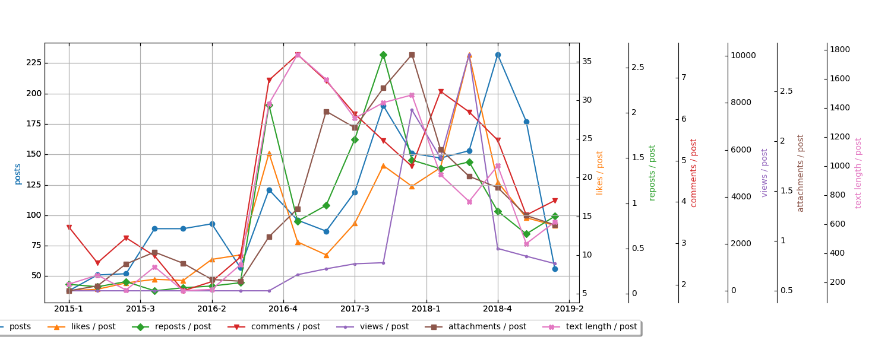

# Анализ "Вестника Рецензии"

Сегодня мы займемся анализом данных и поищем интересные закономерности в содержимом "Вестника Рецензии". Анализ выполнен с помощью утилиты [vk_public_analyzer](https://github.com/qiray/vk_public_analyzer). Выгрузка данных сделана 23 мая 2019 года.

## Общие данные

Сначала общие данные за 4 с небольшим года существования:

| Parameter   | Count   | Average (Mean) | Median | Mode | Stdev     | 
|-------------|---------|----------------|--------|------|-----------| 
| Posts       | 1998    |                |        |      |           | 
| Likes       | 33418   | 16.73          | 10     | 6    | 39.5      | 
| Reposts     | 2184    | 1.093          | 0      | 0    | 4.582     | 
| Comments    | 9924    | 4.967          | 3      | 0    | 7.214     | 
| Views       | 4786273 | 2396           | 428    | 0    | 1.144e+04 | 
| Ads         | 1       | 0.0005005      | 0      | 0    | 0.02237   | 
| Attachments | 3124    | 1.564          | 1      | 1    | 2.1       | 
| Text        | 1843307 | 922.6          | 308.5  | 0    | 1569      | 

Довольно велико среднеквадратическое отклонение у всех показателей, что означает большой разброс значений.

Более 33000 лайков поставили читатели почти 2000 постов. В среднем 16,73 лайка на пост. У половины постов лайков больше 10, а чаще всего встречаются посты с 6 лайками.

Примерно 1 репост есть у каждого поста, однако у половины постов репостов нет вовсе.

5 комментариев у поста в среднем, но у половины постов меньше 3 комментариев.

Почти 2400 просмотров набирает средний пост, однако стоит учесть, что просмотры появились в вк в 2017 году и для более ранних постов показатель равен 0.

За все время всего один пост был помечен как рекламный. Вестник бескорыстный.

В среднем в Вестнике 1,5 вложения на пост, при этом чаще всего встречаются посты с одним вложением.

Во всех постах мы с вами написали 1843307 символов. В то время как в "Войне и мире" 2521613 знаков без пробелов. Не дотянули мы до классика. С другой стороны, средняя и медианная длины текста у нас больше, чем в Суртехе.

## Топовые посты

### Самые комментируемые

| Post                               | Max | 
|------------------------------------|-----| 
| https://vk.com/wall-89009548_11996 | 82  | 
| https://vk.com/wall-89009548_9317  | 74  | 
| https://vk.com/wall-89009548_8703  | 73  | 
| https://vk.com/wall-89009548_2448  | 65  | 
| https://vk.com/wall-89009548_7818  | 63  | 
| https://vk.com/wall-89009548_11664 | 56  | 
| https://vk.com/wall-89009548_12386 | 53  | 
| https://vk.com/wall-89009548_13595 | 51  | 
| https://vk.com/wall-89009548_7253  | 48  | 
| https://vk.com/wall-89009548_10971 | 45  | 

Больше всего комментариев (82) набрала рецензия на фильм "Бегущий по лезвию". Возможно, это связано с именем автора - пост написал Ганс Буравчег.

Серебро с результатом 74 комментария держит новость о том, что раввин разрешил евреям есть клонированную свинину.

Пост о блокировке Телеграма и переходе на аську с минимальным отставанием (73) занимает третье место.

Дальше идут споры о живодерах, религии, рецензиях, правилах паблика, отношениях, самолетах и, конечно же, Nier: Automata.

### Топ по лайкам

| Post                               | Max  | 
|------------------------------------|------| 
| https://vk.com/wall-89009548_10418 | 1012 | 
| https://vk.com/wall-89009548_2874  | 845  | 
| https://vk.com/wall-89009548_10489 | 467  | 
| https://vk.com/wall-89009548_4934  | 391  | 
| https://vk.com/wall-89009548_6468  | 381  | 
| https://vk.com/wall-89009548_6386  | 327  | 
| https://vk.com/wall-89009548_6515  | 323  | 
| https://vk.com/wall-89009548_3024  | 259  | 
| https://vk.com/wall-89009548_10922 | 230  | 
| https://vk.com/wall-89009548_9285  | 228  | 

Думаю, вы не будете сильно удивлены, когда узнаете, что первое место по лайкам занял мем с самолетом. 1012 (!) лайков.

845 лайков у стихотворения про беспеченого инженера. Рок жив!

Третье место и 467 лайков снова у самолета.

А вот дальше интереснее - статьи про преподавание, школы и рутину, устройство авиационных двигателей, программа про скрещивание самолетов, расследование авиакатастрофы Икара и введение в устройство трамваев.

Что приятно - в топе почти одни тексты, а смешных картинок в всего две, хотя обе и занимают лидирующие места.

### Топ по репостам

| Post                               | Max | 
|------------------------------------|-----| 
| https://vk.com/wall-89009548_2874  | 143 | 
| https://vk.com/wall-89009548_6468  | 69  | 
| https://vk.com/wall-89009548_4934  | 53  | 
| https://vk.com/wall-89009548_6515  | 52  | 
| https://vk.com/wall-89009548_10922 | 36  | 
| https://vk.com/wall-89009548_5532  | 33  | 
| https://vk.com/wall-89009548_6386  | 31  | 
| https://vk.com/wall-89009548_7050  | 28  | 
| https://vk.com/wall-89009548_3024  | 27  | 
| https://vk.com/wall-89009548_9285  | 26  | 

143 репоста у уже упомянутого беспеченого инженера.

69 - у статьи о школе и рутине.

53 - у статьи о преподавании в вузе.

Далее идут статьи об авиации, разбавленные киберутопией и трамваями. И снова в топе тексты, а не картинки и видюшки. Ура!

### Самые длинные тексты

| Post                              | Max   | 
|-----------------------------------|-------| 
| https://vk.com/wall-89009548_7415 | 14794 | 
| https://vk.com/wall-89009548_4255 | 14227 | 
| https://vk.com/wall-89009548_6515 | 12572 | 
| https://vk.com/wall-89009548_4761 | 12013 | 
| https://vk.com/wall-89009548_3427 | 11984 | 
| https://vk.com/wall-89009548_6804 | 11675 | 
| https://vk.com/wall-89009548_9100 | 11280 | 
| https://vk.com/wall-89009548_3374 | 11228 | 
| https://vk.com/wall-89009548_3463 | 11058 | 
| https://vk.com/wall-89009548_7566 | 10676 | 

Самый длинный текст в Вестнике - это рецензия Дарьи Менделеевой на рецензию Дмитрия Хабирова на статью Людмилы Петрановской. 14794 символов.

Второе место - рассуждения о культурном потреблении и интеллектуальном ширпотребе. 14227 символов.

Третье - уже знакомый нам герой топа - статья об устройстве двигателей. 12572 символов.

Остальной топ - общественно-политические статьи, история поездки москвича в Киев и неразрушающий контроль.

### Самые просматриваемые

| Post                               | Max    | 
|------------------------------------|--------| 
| https://vk.com/wall-89009548_10418 | 322694 | 
| https://vk.com/wall-89009548_10489 | 235693 | 
| https://vk.com/wall-89009548_7930  | 128384 | 
| https://vk.com/wall-89009548_7815  | 113953 | 
| https://vk.com/wall-89009548_7904  | 84356  | 
| https://vk.com/wall-89009548_10061 | 82643  | 
| https://vk.com/wall-89009548_7921  | 65978  | 
| https://vk.com/wall-89009548_7913  | 64229  | 
| https://vk.com/wall-89009548_7801  | 64117  | 
| https://vk.com/wall-89009548_7953  | 56081  | 

Картинку с улыбающимся самолетом смотрели чаще всего - больше 322 тысяч раз.

Картинку со смеющимся самолетом смотрели всего 235 тысяч раз.

128 тысяч просмотров у рассказа про свободу выбора.

Далее идут рецензия, несколько авиаутр, видео про Талькова, презентация плагина для текстового редактора Subilme и поздравление с получением огонька Прометея.

## Записи без лайков и т.п.

В Вестнике есть:

- 2 поста без лайков (https://vk.com/wall-89009548_2122 и https://vk.com/wall-89009548_2288);
- 1244 поста без репостов;
- 477 записей без комментариев;
- 476 постов без вложений;
- и 215 постов с одними вложениями без текста.

## Информация об авторах

Известно о 61 авторе, писавшем посты в Вестнике. 26 из них стали автором всего одного поста, а 17 написали 10 и более. Также есть огромное количество неподписанных постов, авторы которых неизвестны. Топ-10 авторов выглядит так:

| Author                  | Posts | Likes | Reposts | Comments | Views   | Attachments | Text length | 
|-------------------------|-------|-------|---------|----------|---------|-------------|-------------| 
| Не подписан             | 1074  | 16709 | 908     | 4669     | 2344025 | 1045        | 659106      | 
| [Максим Савин](https://vk.com/id2507182)   | 283   | 8001  | 663     | 1351     | 1279654 | 677         | 341716      | 
| [Евгений Михайлов](https://vk.com/id209581462) | 108   | 1068  | 50      | 503      | 181058  | 126         | 41623       | 
| [Дмитрий Хабиров](https://vk.com/id490425)    | 70    | 965   | 92      | 376      | 102269  | 493         | 157787      | 
| [Данил Михайлов](https://vk.com/id4381982)   | 66    | 966   | 65      | 366      | 114335  | 104         | 85329       | 
| [Ганс Буравчег](https://vk.com/id198878464) | 53    | 579   | 24      | 533      | 90772   | 84          | 147691      | 
| [Кирилл Никольский](https://vk.com/id9302191)   | 44    | 528   | 23      | 225      | 32365   | 43          | 32172       | 
| [Якобиан Иванов](https://vk.com/id14337473)  | 36    | 589   | 45      | 386      | 114003  | 109         | 43014       | 
| [Удаленный профиль](https://vk.com/id253186597) | 28    | 205   | 3       | 227      | 4343    | 28          | 10522       | 
| [Татьянка Полухина](https://vk.com/id136769445) | 24    | 388   | 28      | 77       | 138553  | 78          | 15539       | 

<!-- TODO: расписать подробнее -->

## Информация о вложениях

В посты Вестника вложили:

- 1450 фотографий;
- 795 аудиозаписей;
- 387 опросов;
- 274 ссылки;
- 194 видеозаписи;
- и 18 документов.

## Опросы

В 387 опросах было отдано 49120 голосов. Среднее число голосов на опрос - 126.9, медиана - 72, мода еще меньше - 66 голосов.

### Топ опросов

| URL                               | Votes | 
|-----------------------------------|-------| 
| https://vk.com/wall-89009548_4557 | 3285  | 
| https://vk.com/wall-89009548_6080 | 2024  | 
| https://vk.com/wall-89009548_5222 | 1522  | 
| https://vk.com/wall-89009548_7904 | 879   | 
| https://vk.com/wall-89009548_7989 | 838   | 
| https://vk.com/wall-89009548_8667 | 741   | 
| https://vk.com/wall-89009548_7921 | 587   | 
| https://vk.com/wall-89009548_9947 | 509   | 
| https://vk.com/wall-89009548_9850 | 491   | 
| https://vk.com/wall-89009548_3809 | 488   | 

Самые популярные опросы:

- модификация задачи с вагонеткой - 3285 голосов;

- вопрос про подвески королевы и Су-25 - 2024 голоса;

- вопрос о форме обучения, основанный на рассказе Айзека Азимова "Профессия" - 1522 голоса.

Остальной топ - это авиаутровские вопросы, один кот и оригинал проблемы вагонетки. Безумные опросы в топе встречаются не так часто, как ни странно.

## Самые часто встречающиеся слова

| Слово         | Количество | 
|---------------|------------| 
| https         | 1210  | 
| свой          | 839   | 
| ru            | 756   | 
| хороший       | 681   | 
| com           | 651   | 
| самый         | 634   | 
| самолет       | 550   | 
| становиться   | 479   | 
| статья        | 440   | 
| игра          | 433   | 
| знать         | 337   | 
| говорить      | 332   | 
| дело          | 331   | 
| agregatowrite | 331   | 
| новый         | 331   | 
| фильм         | 317   | 
| мир           | 314   | 
| история       | 310   | 
| vk            | 308   | 
| сделать       | 301   | 
| добрый        | 298   | 
| двигатель     | 298   | 
| вопрос        | 293   | 
| вообще        | 289   | 
| http          | 285   | 
| 2             | 283   | 
| товарищ       | 277   | 
| решать        | 273   | 
| делать        | 273   | 
| книга         | 260   | 

## Анализ тем

| Год  | Темы | 
|------|------| 
| 2015 |  |
| 2016 |  |
| 2017 |  |
| 2018 |  |
| 2019 |  |
| Общее за весь период |  |

## Графики

Напоследок несколько любопытных графиков, показывающих параметры по годам, кварталам, месяцам, дням недели и часам. На графиках представлено количество постов и средние данные по ним - лайки, репосты, комментарии, вложения, просмотры и длина текста. 

**Важно!** Все параметры показываются для соответствующих постов. Т.е., например, лайк, защитанный в 2019 году, - это лайк, поставленный посту, вышедшему в 2019 году. Если лайк в 2019 году поставлен посту 2018 года, то он будет засчитан в данных 2018 года. Все данные приведены по московскому времени.

Данные по годам:

Поквартальный график:

Данные по месяцам:

Данные по дням недели:

Данные по часам:

## Заключение
